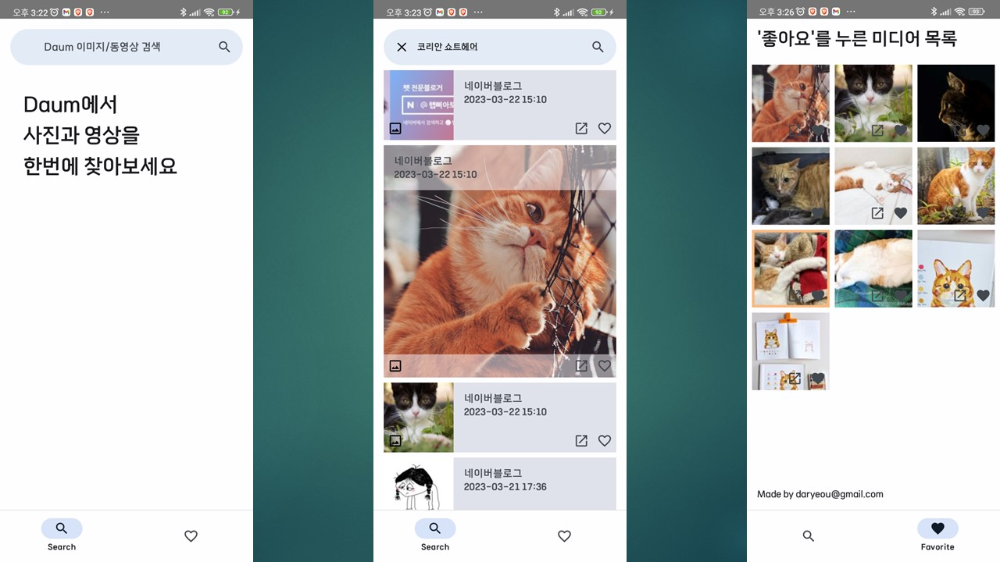
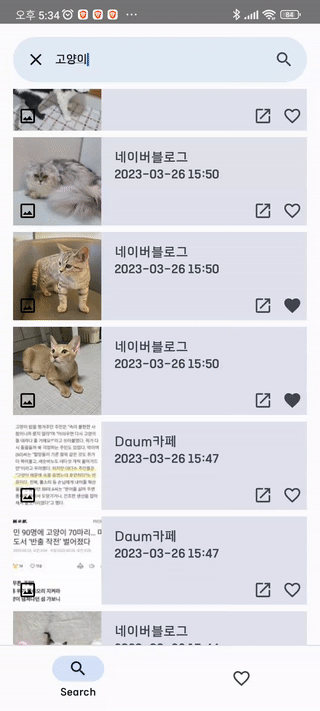
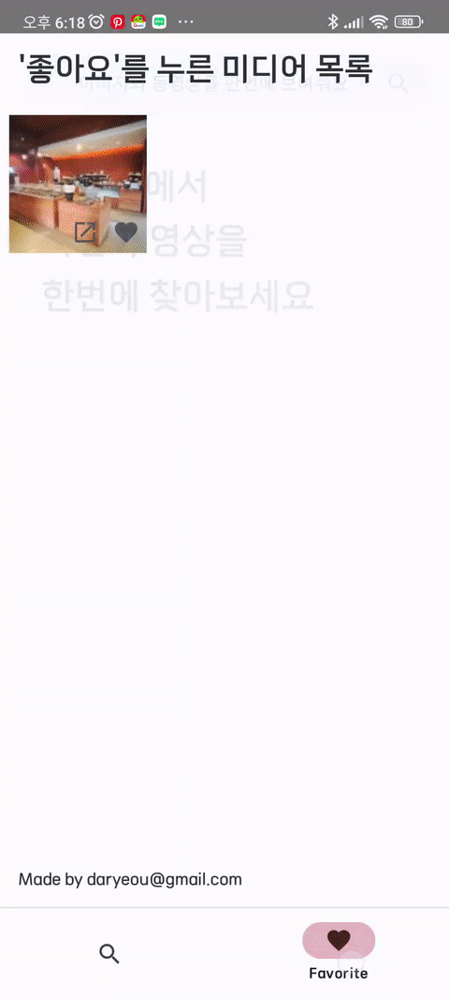

# 카카오뱅크 안드로이드 과제

## 🚧Github에 업로드 된 자료는 API KEY 값을 포함하지 않으므로 실제로 동작하지 않습니다.🚧 ##
 
<br>

2023년 카카오뱅크 Android 개발자 (대규모 채용) 코딩테스트 과제에 참여할 기회를 주신 것에 감사드립니다.

```
1. 과제 설명
이미지를 검색해서 보관함에 수집하는 안드로이드 앱을 작성해주세요.

* 검색은 키워드 하나에 이미지 검색과 동영상 검색을 동시에 사용, 두 검색 결과를 합친 리스트를 사용합니다.
구체적인 사용 필드는 아래와 같습니다.
이미지 검색 API ( https://developers.kakao.com/docs/latest/ko/daum-search/dev-guide#search-image ) 의 thumbnail_url 필드
동영상 검색 API ( https://developers.kakao.com/docs/latest/ko/daum-search/dev-guide#search-video ) 의 thumbnail 필드
* 두 검색 결과를 datetime 필드를 이용해 정렬하여 출력합니다. (최신부터 나타나도록)

* UI는 fragment 2개를 사용합니다. (버튼이나 탭 선택 시 전환)
* 첫 번째 fragment : 검색 결과
검색어를 입력할 수 있습니다.
검색된 이미지 리스트가 나타납니다. 각 아이템에는 이미지와 함께 날짜와 시간을 표시합니다.
스크롤을 통해 다음 페이지를 불러옵니다.
리스트에서 특정 이미지를 선택하여 '내 보관함'으로 저장할 수 있습니다.
이미 보관된 이미지는 특별한 표시를 보여줍니다. (좋아요/별표/하트 등)
보관된 이미지를 다시 선택하여 보관함에서 제거 가능합니다.
* 두 번째 fragment : 내 보관함
검색 결과에서 보관했던 이미지들이 보관한 순서대로 보입니다.
보관한 이미지 리스트는 앱 재시작 후 다시 보여야 합니다. (DB 관련 라이브러리 사용 금지. SharedPreferences 사용 권장)

적혀있지 않은 내용은 자유롭게 작성하시면 됩니다. (요건을 침해하지 않는 범위에서 기능 추가 등)

2. 개발 요건
* 검색 데이터는 https://developers.kakao.com/product/search 의 Open API를 사용합니다.
오픈 소스 사용 가능합니다. 참고로 카카오뱅크에서는 retrofit, kotlinx-coroutines-android, rxjava 등을 사용하고 있습니다.
```

## 🚥 How to build ##

빌드 전, 'secrets.defaults.properties'에 다음과 같이 API KEY 값을 추가해야 합니다.
```
# secrets.defaults.properties
KAKAO_API_URL="https://dapi.kakao.com/"
KAKAO_API_KEY="KakaoAK {Kakao API KEY}
```

e.g.
```
# secrets.defaults.properties
KAKAO_API_URL="https://dapi.kakao.com/"
KAKAO_API_KEY="KakaoAK d87cd5634a458257e3d4asdens2f35"
```

## ⚡Stack ##
   

## 📱 Feature ##

### Daum 이미지/동영상 검색 ###

<br>

### 즐겨찾기 리스트 ###

<br>

### 오류 처리 ##

<br>


## 🖌 Design ##

Material3 의 색상 팔레트를 Figma Plugin을 통해 커스텀 마이징하여 적용

<br>

## ❗ Troubleshooting ##

### 이미지 검색과 동영상 검색의 통합 ###

* 각 API의 호출로 전달받은 데이터의 시간값이 비대칭

페이지 당 50개의 아이템을 표현하기 위해,
두 API를 최신 순으로 호출 후, 리스트의 마지막 아이템의 시간이 가장 최신인 API를 재호출

데이터의 양이 충분하다고 판단되면, Domain에서 ViewModel로 정렬된 데이터를 수집합니다.

### Room의 부재, Sharedpreference 사용 ###

Gson 라이브러리를 사용하여, Data class를 Json 형식의 문자열로 변환하여 저장합니다.

### Paging3 VS without Paging3 ###

적절한 타이밍에 호출하고, Domain 레이어에서의 변형의 용이성을 늘리기 위해 without Paging3를 선택하였습니다.

그러나 Paging3 라이브러리를 사용하는 것이 개발 시간 단축에 도움이 됐을 것이라고 생각합니다.

### '좋아요'화면과 검색 화면간의 동기화 문제 ###

각 화면이 노출 될 때, LaunchEffect를 통해 동기화 하는 과정을 추가하였습니다.

### API KEY 관리 ###

'Secrets Gradle plugin'을 적용하여 root 폴더의 'secrets.defaults.properties'로 부터 API KEY를 가져옵니다.
공개 Repository에는 이 파일을 포함하지 않습니다.

## ❓ Question ##

### XML View VS Jetpack Compose ###

기존에는 xml작성을 통해 View를 사용하고, UI 레이어(Activity, Fragment)에서 명령형 UI 방식으로 조작/변형 하거나,
Data binding을 통해 ViewModel에서의 데이터 변경을 Observer하는 방식이였습니다

또한 xml에서 코드의 실행을 위해 binding adapter를 사용하여 개발의 편리성을 증가시켰습니다.

그러나 여전히 xml을 사용해야한다는 점과 biding adapter로 완전히 대체하기 힘든 한계점이 존재하였습니다.

Compose는 Kotlin을 사용함으로써 기존 코드와 통합하여 사용할 수 있는 장점이 있으며,
파라미터로 값이나 고차 함수를 넘기거나,
상태 호이스팅으로 상위 컴포저블에서 하위 컴포저블의 데이터를 통합하여 관리할 수 있습니다.

또한 deep layout hierarchies를 효율적으로 처리할 수 있어 Constrainlayout을 사용할 필요가 없어졌으며
컴포저블 코드와 함께 직접 값을 주입하여 UI 테스트를 바로 실행할 수 있는 장점을 갖고 있습니다.

## License
```
MIT License

Copyright (c) 2023 daryeou

Permission is hereby granted, free of charge, to any person obtaining a copy
of this software and associated documentation files (the "Software"), to deal
in the Software without restriction, including without limitation the rights
to use, copy, modify, merge, publish, distribute, sublicense, and/or sell
copies of the Software, and to permit persons to whom the Software is
furnished to do so, subject to the following conditions:

The above copyright notice and this permission notice shall be included in all
copies or substantial portions of the Software.

THE SOFTWARE IS PROVIDED "AS IS", WITHOUT WARRANTY OF ANY KIND, EXPRESS OR
IMPLIED, INCLUDING BUT NOT LIMITED TO THE WARRANTIES OF MERCHANTABILITY,
FITNESS FOR A PARTICULAR PURPOSE AND NONINFRINGEMENT. IN NO EVENT SHALL THE
AUTHORS OR COPYRIGHT HOLDERS BE LIABLE FOR ANY CLAIM, DAMAGES OR OTHER
LIABILITY, WHETHER IN AN ACTION OF CONTRACT, TORT OR OTHERWISE, ARISING FROM,
OUT OF OR IN CONNECTION WITH THE SOFTWARE OR THE USE OR OTHER DEALINGS IN THE
SOFTWARE.
```
